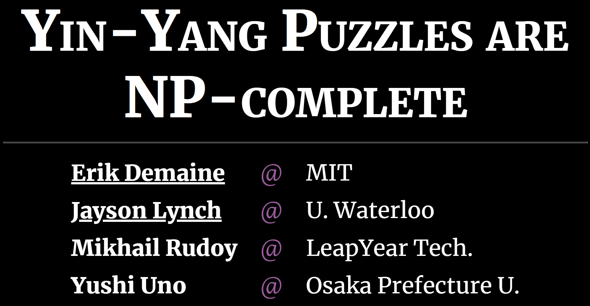
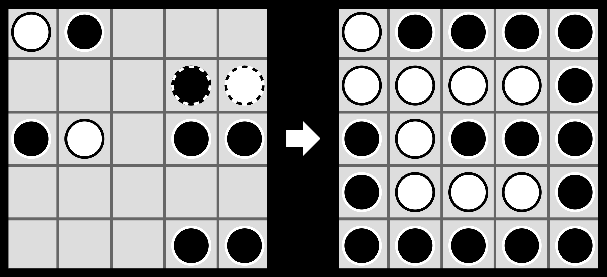

# Talk: Yin-Yang Puzzles are NP-complete

This repository contains slides for a talk given by Erik Demaine and
Jayson Lynch about our CCCG 2021 paper
"[Yin-Yang Puzzles are NP-complete](https://erikdemaine.org/papers/YinYang_CCCG2021/)"
by Erik Demaine, Jayson Lynch, Mikhail Rudoy, and Yushi Uno.
See the paper for more details about the results.

## [View Slides](https://edemaine.github.io/talk-yin-yang/)

[](https://edemaine.github.io/talk-yin-yang/)

[](https://edemaine.github.io/talk-yin-yang/)

## Technology: reveal.js + Pug + Stylus + CoffeeScript + SVG Tiler + SVG.js + KaTeX

This repository uses the
[reveal-pug-talk template](https://github.com/edemaine/reveal-pug-talk)
to make slides by combining the following technology (all free and open source):

* [reveal.js](https://revealjs.com/): a flexible HTML presentation framework,
  extendable by plugins and themes.  Here we use:
  * [Chalkboard](https://github.com/rajgoel/reveal.js-plugins/tree/master/chalkboard):
    enables live drawing annotation on the slides (using pen or touch or mouse)
  * [Merriweather](https://fonts.google.com/specimen/Merriweather) font
* [Pug](https://pugjs.org/): a concise indentation-based notation for HTML,
  which makes it easier to express reveal.js slides,
  and to mix together other languages.  Here we use:
  * [Stylus](https://stylus-lang.com/): a concise indentation-based notation
    for CSS (styling of HTML)
  * [CoffeeScript](https://coffeescript.org/): an indentation-based language
    that compiles to JavaScript
* [SVG Tiler](https://github.com/edemaine/svgtiler):
  a library for converting ASCII art into high-quality SVG graphics
* [SVG.js](https://svgdotjs.github.io/):
  a library that makes it easy to interact with SVG drawings 
* [KaTeX](https://katex.org): a library for translating LaTeX math into HTML
* [Gulp](https://gulpjs.com/): a tool that builds the Pug code into HTML

## Structure

Here's an overview of the individual files and what they do:

* [`gulpfile.coffee`](gulpfile.coffee): Definitions of `build` and `watch`
  rules that run Pug on `index.pug`.
* [`index.pug`](index.pug): Top-level Pug file that calls all other files.
  Defines the top-level structure of the document, but has no slides.
* [`slides.pug`](slides.pug): Slides and specific animations are defined here.
* [`index.styl`](index.styl): Custom reveal.js styling and CSS layout tools.
* [`figures.coffee`](figures.coffee): code to convert ASCII art in `slides.pug`
  into SVG Tiler drawings (via class `figure`, for grid graphs) or
  interactive Yin-Yang puzzles (via class `puzzle`).
* [`yinyang.coffee`](yinyang.coffee): SVG.js-based code to make interactive
  Yin-Yang puzzles, copied from
  [the Yin-Yang font](https://github.com/edemaine/font-yinyang).
* [`TRVB_definition.svg`](TRVB_definition.svg):
  a figure illustrating vertex breaking in the TRVB problem.
* [`TRVB_input.svg`](TRVB_input.svg): a sample instance of TRVB.
* [`TRVB_output.svg`](TRVB_output.svg): a sample solution to TRVB.
* [`puzzle_cover.png`](puzzler_cover.png): the cover of
  [*Puzzler* issue #150](http://hiroshioka1125.life.coocan.jp/puzzle_book_collection/puzzler/101-150/150_199405/150_199405.html).

## Build Instructions

To build the slides HTML (`index.html`) from the source files:

1. Install [NodeJS](https://nodejs.org/) if you haven't already.
2. Clone the repository
3. Run the following:

   ```sh
   npm install
   npm run build
   ```

If you're live-editing the file and want `index.html` to continually build
and update, use the following command:

```sh
npm run watch
```

To assemble just the needed files into a `dist` directory,
use the following command:

```sh
npm run dist
```

To deploy these files to GitHub Pages, use the following command:

```sh
npm run deploy
```
